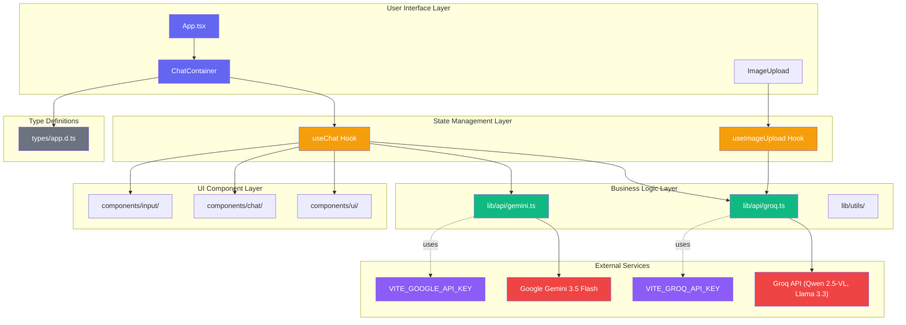
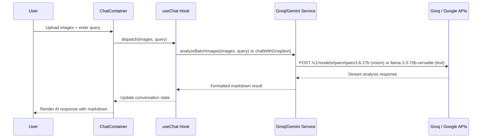

# V - Product Chatbox

A sophisticated AI-powered chatbot interface designed for batch analysis of product images. Upload multiple product images and get instant AI-driven insights about quality, defects, and product characteristics.

## 🚀 Features

### Core Functionality

- **📸 Batch Image Upload** - Upload up to 4 product images simultaneously
- **🤖 Multi-Model AI Analysis** - Powered by Groq (Qwen 2.5-VL, Llama 3.3) and Google Gemini 3.5 Flash
- **💬 Natural Chat Interface** - Clean, ChatGPT-style conversation flow
- **🎯 Product-Focused Insights** - Specialized in product quality, defects, and visual analysis

### Technical Features

- **⚡ Real-time Processing** - Live loading states with immediate feedback
- **📝 Markdown Responses** - Beautifully formatted AI responses
- **🎨 Responsive Design** - Optimized for desktop and mobile devices
- **🛡️ Error Handling** - Comprehensive error boundaries and user feedback

## 🛠️ Technology Stack

| Category             | Technologies                                           |
| -------------------- | ------------------------------------------------------ |
| **Frontend**         | React 19, TypeScript, Vite (Rolldown)                  |
| **Styling**          | Tailwind CSS v4 (config-in-CSS)                        |
| **AI Integration**   | LangChain.js, Groq (Qwen 2.5-VL 72B, Llama 3.3 70B), Google Gemini 3.5 Flash |
| **State Management** | React Hooks                                            |
| **Build Tool**       | Vite (aliased to `rolldown-vite@7.3.1`)                |
| **Package Manager**  | Bun                                                    |

## 📦 Quick Start

### Prerequisites

- Node.js 18+ or Bun
- Groq API key (required for image analysis)
- Google AI Studio API key (optional, for Gemini fallback)

### Installation

1. **Clone & Setup**

```bash
git clone <repository-url>
cd v-chatbot
bun install
```

2. **Environment Configuration**

```bash
cp .env.sample .env
```

Add your API keys:

```env
VITE_GROQ_API_KEY=your_groq_api_key
VITE_GOOGLE_API_KEY=your_google_ai_studio_api_key
```

> **Note:** `VITE_GROQ_API_KEY` is required for image analysis. `VITE_GOOGLE_API_KEY` is optional and provides a fallback text-only chat.

3. **Launch Development Server**

```bash
bun run dev
```

## 🎯 How to Use

### Basic Workflow

1. **Upload Product Images**

   - Click the 📎 attachment button
   - Select up to 4 product images
   - Supported formats: JPG, PNG, WebP, GIF (max 10MB each)

2. **Ask Analysis Questions**

   - "Are there any visible defects?"
   - "Is this product new or used?"
   - "How many items are in this image?"
   - "Compare the quality across these images"

3. **Review AI Insights**
   - Individual analysis for each image
   - Markdown-formatted responses
   - Quality assessments and recommendations

### Example Conversation

```
👤 User: [Uploads 3 product images]
       "Check for any manufacturing defects"

🤖 V-Chatbox:
   ## Batch Analysis Results

   ### 📸 product_front.jpg
   **Assessment:** Good overall quality
   **Findings:**
   • No visible scratches or dents
   • Color consistency is excellent
   • Packaging appears intact

   ### 📸 product_side.jpg
   **Issues:**
   • Minor scratch on lower left corner
   • Slight color variation from front image
```

## 🏗️ Architecture



### Folder Structure

```
src/
├── 🗣️  components/chat/          # Chat interface components
├── ⌨️  components/input/         # User input components (upload, textarea)
├── 🎨 components/ui/            # Reusable UI primitives
├── ⚡ hooks/                    # Custom React hooks (useChat, useImageUpload)
├── 🔌 lib/api/                 # AI integration (groq.ts, gemini.ts)
├── 📚 lib/utils/               # General utilities (messageUtils.ts)
├── 📋 types/                   # Shared TypeScript types (app.d.ts)
└── 🎯 App.tsx                  # Application root
```

### Component Hierarchy

```
App.tsx
└── ChatContainer
    ├── ChatMessages (conversation history)
    │   ├── UserMessage
    │   ├── AssistantMessage
    │   └── BatchResults (AI analysis results)
    ├── ChatInput (text + image controls)
    │   ├── MessageTextarea
    │   ├── ImageUploadButton
    │   └── ImageAttachments (preview gallery)
    └── ImagePreview (uploaded image gallery)
```

### Data Flow



### Key Components

| Component | File | Role |
|-----------|------|------|
| **App** | `src/App.tsx` | Application root, error boundary, mounts ChatContainer |
| **ChatContainer** | `src/components/chat/ChatContainer.tsx` | Main layout, header, message area, input area |
| **useChat** | `src/hooks/useChat.ts` | Manage conversation state, AI calls, message lifecycle |
| **useImageUpload** | `src/hooks/useImageUpload.ts` | Handle image processing, validation, base64 conversion |
| **groq** | `src/lib/api/groq.ts` | Groq API integration (Qwen vision, Llama text) |
| **gemini** | `src/lib/api/gemini.ts` | Google Gemini API integration (fallback) |
| **BatchResults** | `src/components/chat/BatchResults.tsx` | Display per-image analysis results in card format |
| **MessageList** | `src/components/chat/MessageList.tsx` | Render conversation history (UserMessage + AssistantMessage) |
| **MarkdownRenderer** | `src/components/ui/MarkdownRenderer.tsx` | Render markdown content with react-markdown |

## 🔌 API Integration

### Groq (Primary - Vision + Text)

```typescript
// Multimodal image analysis (Qwen 2.5-VL 72B)
const analysis = await analyzeBatchImages(images, query);

// Text-only chat (Llama 3.3 70B Versatile)
const response = await chatWithGroq(userMessage);
```

### Google Gemini (Fallback - Text Only)

```typescript
// Text-only chat (Gemini 3.5 Flash)
const response = await chatWithGemini(userMessage);
```

### Supported Analysis Types

- ✅ Product defect detection
- ✅ Quality assessment
- ✅ Quantity counting
- ✅ Condition evaluation
- ✅ Comparative analysis
- ✅ Custom user queries

## 🎨 Customization

### Adding New Analysis Templates

```typescript
// In src/lib/api/groq.ts or gemini.ts
const createProductAnalysisPrompt = (query: string) => `
You are a product quality specialist analyzing e-commerce images.

Focus on:
• Manufacturing defects
• Packaging quality
• Visual presentation
• Consistency across product lines

User Question: "${query}"
`;
```

### Styling Modifications

- Update Tailwind classes in component files
- Modify theme tokens in `src/index.css` (Tailwind v4 config-in-CSS)
- Extend UI components in `src/components/ui/`

## 📋 Available Scripts

| Command           | Description              |
| ----------------- | ------------------------ |
| `bun run dev`     | Start development server |
| `bun run build`   | Create production build  |
| `bun run lint`    | Run code linting         |
| `bun run preview` | Preview production build |

## 🤝 Contributing

We welcome contributions! Please:

1. Fork the repository
2. Create a feature branch (`git checkout -b feature/improvement`)
3. Commit your changes (`git commit -m 'Add new feature'`)
4. Push to the branch (`git push origin feature/improvement`)
5. Open a Pull Request

## 📄 License

This project is licensed under the MIT License.

## 🙋‍♂️ Author

**Deepak Guptha Sitharaman**  
_Full-Stack Developer_

- GitHub: [@vzan2012](https://github.com/vzan2012)
- Email: deepak.guptha.s@gmail.com / vzan2012@gmail.com
- Portfolio: http://vzan2012.github.io

## 🙏 Acknowledgments

- **Groq** for ultra-fast inference with Qwen and Llama models
- **Google Gemini AI** for advanced multimodal capabilities
- **LangChain.js** for seamless AI integration
- **React Team** for the incredible framework
- **Tailwind CSS** for the utility-first styling approach

## 📞 Support

- **Documentation**: Check this README and code comments
- **Issues**: Open a GitHub issue for bugs or feature requests
- **Questions**: Reach out via email or GitHub discussions

---

**V - Product Chatbox** - Transforming product analysis through AI-powered batch processing. 🚀

_Built with modern web technologies for the next generation of e-commerce workflows._